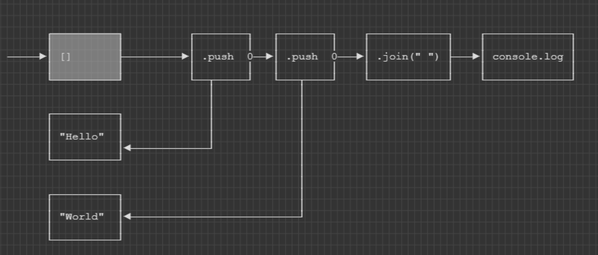

# Intro

Graff is a plain-text ASCII art programming language interoperable with JavaScript.



All programs proceed **West to East**.

To follow any graff, trace the arrow of any node exiting the _East_ side to the next step in the program.

# Overview

**This is an experiment** in designing a 2D programming language that is still plain-text.

So far, there is only an incomplete specification.

1. If you want to bikeshed the speicification, open an issue!
1. If you want to ask a question, also feel free to in an issue.
1. If you want to tackle writing a parser, please do! 
    I will likely give you write access.

I use [asciiflow.com](https://asciiflow.com/) for all my diagrams.

# Credits

Anyone who helps contribute will be listed here.

# Examples

## Fizz Buzz

```js
          ┌───────────────────────┐
          │                       │
          │         ┌─────────────┼───────────────────────────────────────────────┐
          │         │             │                                               │
          │         │    ┌──────┐ │                                               │
          │         └───►│ $1+1 ├─┘                              ┌─────────────┐  │
          │              └──┬───┘         ┌───────────────┬─────►│ console.log ├──┘
          │                 │             │               │      └─────────────┘
          │     ┌───────────┘             │               │
          │     ▼                         │               │
          └──►┌───┐   ┌──────────────┐    │               │
    ┌───┐     │$0 ├──►│              ├────┘               │
───►│ 1 ├────►└───┘   │     $0       │                    │
    └───┘             ├──────────────┤                    │
                      │              │       ┌───┐        │
                      │  $0>100      ├──────►│   │        │
                      │              │       └───┘        │
                      ├──────────────┤                    │
                      │              │       ┌──────────┐ │
                      │   $0%15==0   ├──────►│"FizzBuzz"├─┤
                      │              │       └──────────┘ │
                      ├──────────────┤                    │
                      │              │       ┌──────┐     │
                      │   $0%5==0    ├──────►│"Fizz"├─────┤
                      │              │       └──────┘     │
                      ├──────────────┤                    │
                      │              │       ┌──────┐     │
                      │   $0%3==0    ├──────►│"Buzz"├─────┘
                      │              │       └──────┘
                      └──────────────┘
```

## Fibonacci Number

```js
                            ┌────────────────────────────────────────────────────────────────────┐
                            │                                                                    │
                            │                                    ┌─────┐                         │
                            │                                    │     │                         │
                            │      ┌──────┐      ┌──────────────►│  1  ├────────────────────────►│
                            ├─────►│      ├──────┘               └─────┘                         │
                            │      │  =1  │         ┌──────┐              ┌─────┐                │
                            │      │      ├─────────┤      ├─────────────►│     ├───────────────►│    ┌───────────────┐
                            │      └──────┘         │ =0   │              │ 0   │                │    │               │
                            │                       │      ├───────┐      └─────┘                ├───►│  console.log  │
                            │                       └──────┘       │                             │    │               │
                            │                                      │      ┌─────┐                │    │               │
    ┌────────────────┐      │                                      └─────►│ +   ├───────────────►│    └───────────────┘
    │                │      │                                             └┬───┬┘                │
───►│ process.argv[0]├─────►│               ┌────────┐    ┌───────┐        │   │                 │
    │                │      │               │        │    │       │        │   │                 │
    └────────────────┘      │◄──────────────┤  -1    │◄───┤ Self  │◄───────┘   │                 │
                            │               │        │    │       │            │                 │
                            │               └────────┘    └───────┘            │                 │
                            │                                                  │                 │
                            │                                                  │                 │
                            │                                                  │                 │
                            │               ┌────────┐    ┌───────┐            │                 │
                            │               │        │    │       │            │                 │
                            │◄──────────────┤  -2    │◄───┤ Self  │◄───────────┘                 │
                            │               │        │    │       │                              │
                            │               └────────┘    └───────┘                              │
                            │                                                                    │
                            │                                                                    │
                            │                                                                    │
                            │                                                                    │
                            └────────────────────────────────────────────────────────────────────┘
```

# Milestones

1. Command line interpreter.
1. Arrow analyzer. Check for errors in control flow rules statically.
1. Import/Export with JS and TypeScript.
1. Can compile to a webpack bundle alongside other JavaScript.

# Concepts

Graffs are intended to be easy to reason about.
Starting at any node, it should be easy to trace the program execution forward as well as backwards.

Graff mixes imperative programming nodes with functional programming nodes.
Separating side-effect and (hopefully) non-side-effect nodes helps reason about a graff.
You can tell which type of node based on the arrows.

1. Arrows pointing out from the East are imperative. We call thse _Forward Nodes_.
    
    ```
       ┌──────┐
    ──►│ foo  ├──►
       └──────┘
    ```
    Think _do this, then that_, like imperative control flow.

1. Arrows pointing in from the East are functional. We call these _Reverse Nodes_.
    ```
       ┌──────┐
    ◄──┤ foo  │◄──
       └──────┘
    ```
    Think _that needs this_, like function arguments.

Everything else is syntactic sugar to minimize syntax for common operations and use cases.

# By Example

_Translations are approximate. The exact compiler specification does not exist_.

## Hello

```
      ┌───────────────────────┐
─────►│  console.log("Hello") ├
      └───────────────────────┘
```

Is equivalent to `console.log("Hello")`, which has the same result as the following:

```
      ┌──────────┐        ┌──────────────┐
─────►│  "Hello" ├───────►│ console.log  │
      └──────────┘        └──────────────┘
```

which is equivalent to:

```js
var $0 = "Hello"

console.log($0)
```

## Adding

```
   ┌───┐
──►│ 1 ├─┐  ┌───┐
   └───┘ └─►│ + ├────►
            └─┬─┘
   ┌───┐      │
   │ 2 │◄─────┘
   └───┘
```

Is equivalent to:

```js
var $0 = 1
var $1 = 2
var $3 = $0 + $1
```

## Branching

```
      ┌────────┐       ┌───────────────────────────────────────┐
      │        0──────►│console.log($0, "Is Greater than Zero")│
─────►│   >0   │       └───────────────────────────────────────┘
      │        0───┐
      └────────┘   │   ┌───────────────────────────────────────────┐
                   └──►│console.log($0, "Is not greater than zero")│
                       └───────────────────────────────────────────┘
```

For an arbitrary input `$0`, is approximately equivalent to:

```js
var $0 = /* something */

if ($0 > 0) {
    console.log($0, "Is Greater than Zero")
} else {
    console.log($0, "Is not greater than zero")
}
```

Although in practice, it may be implemented differently. See [Implementation](#Implementation) for details.

## Multiple Arrows

```
   ┌────┐  ┌───────┐
   │    │  │       │    ┌───────────┐
──►│ [] ├─►│ .push 0───►│console.log│
   │    │  │       │    └───────────┘
   └────┘  └──┬────┘
              │
  ┌───────┐   │
  │foo.get│◄──┘
  └───────┘
```

Is approximately:

```js
var $0 = []

$0.push(foo.get())

console.log($0)
```

Hopefully you're starting to get the idea.
There are precice rules for what arguments go where based on the arrow positions and directions.

# Specification

_WARNING: Here Be Dragons_

## Terminology

### Nodes

A node is any box, using a variety of ASCII characters.
Boxes have four walls, identified by North, East, South, and West. North being upwards.

1. Boxes must be complete. No gaps.
1. Corners must use `┐┘└┌` appropriately, or use `+`.
1. East and West walls must use the same characters, either `|` or `│`.
1. North and south walls must use the same characters, either `─` or `-`.
1. There are exceptions, noted below, when walls may be intermixed with text.
    1. Regardless, there can be no spaces in a wall.

### Arrows

The simplest arrow is `->` or `─►`.

1. Arrows require a tail, and a head.
1. Arrows move horizontally or vertically. There are no diagonal arrows.
1. Arrows can bend at 90 degrees using the appropraite `┐┘└┌` or `+`.
1. Arrows must start from a wall, and end on a wall. 
1. Arrows cannot pass through a wall, or break a wall.
    1. There is an exception for function closures, noted below.
1. Arrows can join other arrows. 
    These are interpreted as two separate arrows with the same destination.
    ```
    ────────┐
            │
            ├─────────►
            │
    ────────┘
    ```
1. Multiple arrows cannot break from a single arrow.
    ```
                ┌──────►
                │
                │
    ────────────┤   (Not Allowed)
                │
                │
                └──────►
     ```
1. Arrows may intersect other arrows in the following ways.
    1. One arrow breaks, one continues.
    
        ```
              │
              │
       ────────────►
              │
              ▼
        ```
    1. Arrows meet with a cross, either `┼` or `+`:
 
         ```
                  │
                  │
                  │
           ───────┼────►
                  │
                  ▼
        ```
    1. Arrows cannot cross at a bend, or travel in parallel while overlapping.
1. Allowed bun not encouraged:

    ```
    ││
    ││
    ││
    ▼▼
    ```

## Header

If the first character of the file is a space, the entire file is immediately parsed as the program body.
If the first character is anything else, a JavaScript/TypeScript header is assumed.

In the header any JavaScipt or TypeScript may preceed the file contents.
This is helpful for imports.

Two blank lines (`\n\n` or `\r\n\r\n`) indicate the end of the header, and the beginning of the body.

```js
/**
 * Copyright...
 */
import {foo} from "bar"


     ┌─────┐     ┌─────────────┐
────►│ foo ├────►│ console.log │
     └─────┘     └─────────────┘
```

## Comments

Comments are any text _outside of any node_ that are surrounded in parentheses.

```
(this is a comment)
```

or

```
(this is a)
(multi-line comment)
```

Comments are also allowed in _function definition nodes_ discussed below.

## Nodes and Arrows

When referring to a Node, any arrow whose tail touches the Node wall is called an **Out Arrow**.
Any arrows whose head touches the Node wall is called an **In Arrow**.

For the _North_ and _South_ walls, arrows are called **Reverse Arrows**.
For the _East_ and _West_ walls, arrows are called **Forward Arrows**.

```
      (A) ◄──┐
             │
             │
         ┌───┴─────┐
         │         │
(D) ────►│         ├────► (B)
         │         │
         └─────────┘
             ▲
             │
             │
        (C)──┘
```

1. Arrow (A) is a Reverse Out Arrow
1. Arrow (B) is a Forward Out Arrow
1. Arrow (C) is a Reverse In Arrow
1. Arrow (D) is a Forward In Arrow

## Arrows and Nodes

Arrows carry values, and those values have types.

1. Types may be annotated with non-breaking text that intersects the arrow horizontally.

    ```
    ────int64─────►
    ────string─────►
    ────number─────►
    ────My.Thing─────►

      │
      int
      │
      ▼

      │
     string
      │
      ▼

      │
    My.Thing
      │
      ▼
    ```
    1. The arrow must have at least one tail section and head surrounding the type.
    1. Type names cannot touch any other Node, text, or arrow.
1. Forward arrows carry values from their tail to their head.
    
    ```
    ┌──────┐       ┌──────┐
    │      │       │      │
    │  1   ├──────►│      │
    │      │       │      │
    └──────┘       └──────┘

      (A)             (B)
    ```
    The value _1_ is carried from A to B.
1. Reverse arrows carry values from their head to their tail.

    ```
       ┌──────────────┐
       │              ▼
    ┌──┴───┐       ┌──────┐
    │      │       │      │
    │      │       │  -1  │
    │      │       │      │
    └──────┘       └──────┘

      (A)             (B)
    ```
    The value -1 is carried from B to A.

### Home and Away Arrows

Relative to a Node, arrows carrying values _into_ that node are referred to as its **Home Values**.
Forward In Arrows and Reverse Out Arrows carry Home Values.
Arrows carrying values _out of_ that node are referred to as **Away Values**.
Forward Out Arrows and Reverse In ARrows carry Away Values.

When multiple arrows carry Home Values, they have a **Home Order**.

1. Arrows are numbered monotonically in increasing order starting from 0.
1. Arrows are indexed from the North-East beginning at 0, and increasing moving counter-clockwise.
1. Only Arrows carrying Home Values indexed. i.e. Forward In Arrows, and Reverse Out Arrows.

    ```
                              ┌───► (Arrow 0)
                              │
              (Skipped)────┐  │
                           │  │
                           ▼  │
                ┌─────────────┴─┐
    (Arrow 1)   │               │
     ─────────► │               │ (Skipped)
                │               ├──────────►
                └───┬───────────┘
                    │       ▲
                    │       │
                    │       │
      (Arrow 2)  ◄──┘       │ (Skipped)
                            │
    ```

### Arrow Value

Arrows carrying Away Values may _choose_ the value they carry.

1. By default, Away Values copy the return value of the nodes body.

    ```
         ┌─────┐     ┌─────────┐
         │     │     │         │  (A)
    ────►│  1  ├────►│   +1    ├─────►
         │     │     │         │
         └─────┘     └─────────┘
     ```
     Arrow (A) carries the Away Value of _2_.
1. The Away Values can copy any Home value by annotating the arrow-wall boundary with the Home value's order index.

    ```
         ┌─────┐     ┌─────────┐
         │     │     │         │  (A)
    ────►│  1  ├────►│   +1    0─────►
         │     │     │         │
         └─────┘     └─────────┘
    ```
    Arrow (A) carries the Away Value of 1, because it _copied_ the Home Value at index 0.

## Control Flow

1. Nodes execute their contents when they have **Control**.
1. There are two types of control, **Forward Control** and **Reverse Control**.
1. Control can be passed between nodes using arrows.
1. Nodes which can recieve forward control are called **Forward Nodes**. 
1. Nodes which can recieve reverse control are called **Reverse Nodes**.
1. All nodes are either forward or reverse.

### Forward Nodes

Forward control represents imperative control flow of a program.
The program proceeds in discrete steps, completing the previous step before the next.

1. Forward nodes have arrows that enters from the West, and optionally exit to the East.

    ```
         ┌───────┐     ┌───────┐
    ────►│ A     ├────►│ B     │
         └───────┘     └───────┘
    ```
    Both _A_ and _B_ are forward nodes.
1. A node recieves forward control from the West, and passes control to the East.
1. If a node has no out arrows from the East, it is a **Terminal node**. 
   Program execution terminates after that node completes its task.
1. Forward nodes may form cycles.

    ```
         ┌───────┐     ┌───────┐
    ┌───►│ A     ├────►│ B     ├───┐
    │    └───────┘     └───────┘   │
    │                              │
    └──────────────────────────────┘
    ```

### Reverse Nodes

Reverse control mixes functional programming into an imperative workflow.
Each node in a reverse graff is part of a single functional mini-program.
Instead of passing control, reverse nodes yield control, awaiting values from the next node in the computation.
Eventually all computations resolve, and the entire chain of reverse nodes unwinds to return its final value to the Forward Node which originally spawned it.

1. Reverse nodes have In Arrows from the East, and Out Arrows from the West.

    ```
    ┌────┐      ┌────┐
    │ B  │◄─────┤ A  │
    └────┘      └────┘
    ```

    Reverse nodes resolve in reverse order, where _B_ resolves before _A_, because A may depend on B.
1. A forward node with forward control may initiate reverse control to a reverse node via its South or North walls.
    1. Reverse control is indicated by an _Out Arrow_ from the North or South wall of the forward node.
    
        ```
        ┌────────────────┐
        │ Reverse Node   │◄───┐
        └────────────────┘    │
                              │
                       ┌──────┴───────┐
                    ──►│ Forward Node ├─►
                       └──────────────┘
        ```
    1. Forward control pasues while reverse control is executing.
    1. Forward control is resumed once reverse control terminates.
1. Reverse Nodes recieve reverse control from the east, and pass reverse control to the west.
1. Reverse Nodes _return_ control in addition to a _value_.
1. If a node has multiple arrows along the west wall, only the node which originally passed reverse control recieves the value.

    ```
                ┌────┐
             ──►│ F2 ├──►
                └─┬──┘
                  │
                  └─────┐
                        │
    ┌────┐      ┌────┐  │
    │ B  │◄─────┤ A  │◄─┤
    └────┘      └────┘  │
                        │
                  ┌─────┘
                  │
                ┌─┴──┐
             ──►│ F1 ├──►
                └────┘
    ```
    If _F1_ has forward control, when _A_ resolves it returns its value to _F1_ not _F2_.
1. If a forward node has multiple out arrows, there is no guaruntee which nodes recieve reverse control first. 

    ```
    ┌────┐
    │ R2 │◄──────┐
    └────┘       │
                 │
    ┌────┐       │
    │ R1 │◄──┐   │
    └────┘   │   │
             │   │
          ┌──┴───┴──┐
          │         │
          │  Fwd    │
          │         │
          └─────────┘
    ```
    There is no guaruntee which of _R1_ or _R2_ recieves Reverse Control first.

## Operators

1. A lone operator e.g. `+` is treated as an *Infix Operator* node.

## Branching

Branching nodes have multiple horizontal partitions within a single box.
Each partition must have one Out Arrrow from its East wall.

```
    ┌────────────┐
───►│    < 0     │──────────►
    ├────────────┤
    │  false     ├──────────►
    └────────────┘
```

Branching nodes act both like switch statments, and like if/else statements.
Processing occurs as follows:

1. The value of the Northern partition is evaluated, called the **Subject**.
1. The value is compared, from North to South, to each successive partition using a **Comparator** generated from that paritions content.
1. If the comparator matches, the Out Arrow associated with the comparators paritition is followed.
1. Comparators are generated as follows:
    1. If the partition contains a literal, the literal must exactly match the Subject.
    1. If the partition contains a unitary operator, the operator is applied to the subject.
        A truthy value indicates a match.
    1. If the partition contains a statement, the statement is evaluated with `$$` set to the Subject.
    1. All arguments `$0`, etc. are accessible from the comparator.
1. The value carried by the Out Arrow of a partition is copied from return value of the comparator.
1. Referencing a branching node returns the value from the first partition.

Convenience shortcut:

For simple _if/else_ branching nodes, the partition may be elided.

```
    ┌────────────┐
    │            ├──────────► (true)
───►│    < 0     │
    │            ├──────────► (false)
    └────────────┘
```

## Literals

1. Literals may recieve and pass forward control.
1. Literals may recieve reverse control, but cannot pass it.

There are ambiguities when writing negative numbers e.g. `-1`.
This could represent the `-1` literal, or be a subtraction operator.

Current solution: Wrap `-1` in parenthesis `(-1)`.

## Function Nodes

Function Nodes are meta-nodes. They are nodes which contain other nodes.

Consider the following trivial and pointless function.

```
┌─Hello───────────────────┐
│                         │
│     ┌──────────┐        │
├────►│          ├───────►│
│     │  "World" │        │
│     │          │        │
│     └──────────┘        │
│                         │
└─────────────────────────┘
```

This is a function named `Hello`, which return the string `"World"`.

You call this function by using its name in another node.

```
     ┌───────┐   ┌─────────────────┐
────►│ Hello ├──►│ console.log     │
     └───────┘   └─────────────────┘
```

1. A function can only contain valid nodes, arrows, and comments.
1. Functions may optionally be given a name, written along its North wall, starting from the West going east.
1. A single out arrow, beginning from the West wall starts the function control flow.
    Only one out arrow may start from the West wall.
1. At least one in arrow must arrive at the East wall.
    The arrows value will be the functions return value.
1. Functions may use recursion with a `Self` node, but `Self` nodes cannot recieve forward control.
1. Zero or more In Arrows, originating from the West Wall are allowed.
    These serve as references to the functions argument.
    
    ```
                 ┌─Add───────────────────┐
                 │                       │
                 │◄───────┐              │
                 │        │              │
    (1) ────────►│      ┌─┴─────┐        │
                 │      │       ├───────►│ (2)
                 ├─────►│   +   │        │
                 │      │       │        │
                 │      └───────┘        │
                 │                       │
                 └───────────────────────┘
    ```
1. Functions can be multi-argument.
    1. Each internal Arrow (In or Out) touching the North, West, or South wall is an argument.
    
        ```
        ┌─Join──────────────────┐
        │         ▲             │
        │         │             │
        │         │             │
        │      ┌──┴────┐        │
        │      │       ├───────►│ (Hello World)
        ├─────►│   +   │        │
        │      │       │        │
        │      └───────┘        │
        │                       │
        └───────────────────────┘
        ```
    1. Argument order follows _Home Order_ rules. i.e.
    The rightmost argument on the North wall is always first.
    The rightmost argument on the South wall is always last.
    The west wall argument occurs between the north and south arguments. 
    1. Argument order is maintained, even if the calling arrows do not align with the function arrows.
        ```
             ┌────────┐
             │        │
        ────►│"Hello "├───┐
             │        │   │    ┌──────────┐
             └────────┘   │    │          │
                          └───►│ Join     │─►
             ┌────────┐        │          │
             │        │        └─┬────────┘
             │"World" │          │
             │        │◄─────────┘
             └────────┘
        ```
    1. Since only one value occurs on the West wall, multiple internal arrows to the west wall consume only one argument. 
    1. Arguments may also be named
        ```
             ┌─Join────LHS───────────┐
             │         ▲             │
             │         │             │
             │         │             │
             │      ┌──┴────┐        │
             │      │       ├───────►│ (Hello World)
            RHS────►│   +   │        │
             │      │       │        │
             │      └───────┘        │
             │                       │
             └───────────────────────┘


             ┌────────┐
             │        │
        ────►│"Hello "├───┐
             │        │   │    ┌──────────┐
             └────────┘   │    │          │
                          └──►LHS  Join   ├──►
             ┌────────┐        │          │
             │        │        └─RHS──────┘
             │"World" │          │
             │        │◄─────────┘
             └────────┘
        ```

## References

A node may reference any previously computed value returned by a node.

1. A reference is an out arrow, starting from the north or south walls.
1. The reference in arrow must end at the other nodes north or south wall.
1. The reference must not break causality. Examples:
    1. This is okay, since A happens before B.
        ```
               ┌───────────────┐
               ▼               │
            ┌─────┐         ┌──┴──┐
            │     │         │     │
        ───►│ A   ├────────►│ B   ├──────►
            │     │         │     │
            └─────┘         └─────┘
        ```
    1. This is disallowed because A happens before B. 

        ```
                  ┌────────────────┐
                  │                ▼
               ┌──┴──┐         ┌─────┐
               │     │         │     │
        ──────►│ A   ├────────►│ B   ├──────►
               │     │         │     │
               └─────┘         └─────┘
        ```
   1. References from reverse nodes are possible.
        ```
            ┌───────┐
            │       │     ┌─────┐
        ───►│  A    ├────►│     │
            └───────┘     │ B   ├──────►
               ▲          │     │
               └─────┐    └──┬──┘
                     │       │
                 ┌───┴─┐     │
                 │     │     │
                 │ C   │◄────┘
                 │     │
                 └─────┘
        ```
    1. But C cannot reference B because B depends on C.
        ```
            ┌───────┐
            │       │     ┌─────┐
        ───►│  A    ├────►│     │
            └───────┘     │ B   ├──────►
                          │     │
                          └─────┘
                            ▲  │
                     ┌──────┘  │
                 ┌───┴─┐       │
                 │ C   │◄──────┘
                 │     │
                 └─────┘   
        ```
# Start

Control flow originates from the files 0th column, along any row.
A single Outward Arrow must start at the edge and touch a single nodes West wall.
That node begins forward control execution.

```
          ┌────────┐
          │        │
─────────►│ "Start"│
          │        │
          └────────┘
```

It is an error for multiple arrows to touch the 0th column.

```
          ┌─────────┐
─────────►│ "Start1"│
          └─────────┘
   (ERROR)
          ┌─────────┐
─────────►│ "Start2"│
          └─────────┘
```

Execution ends when a node fails to pass control after its completion.

# JavaScript Interoperability

1. Arrow Values are accessible from JavaScript, starting from `$0` and incrementing upward to the number of Arrow Values.
    Ordering follows the same rules as _Home Order_. 
1. Functions written to nodes are called against the nodes In Arrows, following the same resolution ordering as function nodes.
1. Methods written to nodes are called _properly_. The `this` reference will remain intact.

    ```
    ┌─────────┐            ┌──────────────┐
    │         │            │              │
    │ "Hello" ├───────────►│ console.log  │
    │         │            │              │
    └─────────┘            └──────────────┘
    ```
    Is evaluted like `console.log("Hello")`.
1. You can write as much JavaScript as you like in a node.
1. Nodes are evaluated in the module scope. Variables assigned in one node are accessible in another.

    ```
        ┌────────────────┐          ┌───────────────┐
    ───►│ var x = "Hello"├─────────►│console.log(x) │
        └────────────────┘          └───────────────┘
    ```
1. **Implicit Methods** are methods called on an incoming argument.
    Implicit methods begin with a `.`.

    ```
          ┌──────────┐          ┌────────┐
    ─────►│    []    ├─────────►│ .push  ├──►
          └──────────┘          └──┬─────┘
                                   │
          ┌──────────┐             │
          │ "Hello"  │◄────────────┘
          └──────────┘
    ```
    The above is equivalent to `[].push("Hello")`
1. Nodes that return `Promise` objects or Promise-like objects will be awaited before continuing.
    (i.e.) node Home Values never recieve promises, only their unwrapped values.
1. Exceptions terminate control flow, and rejected promises trigger exceptions.
1. Function Nodes with names can be exported

    ```
    export {Foo} 


    ┌─Foo───────┬───────────┐
    │           │           │
    │           ▼           │
    │        ┌──────┐       │
    ├───────►│      ├──────►│
    │        │  +   │       │
    │        └──────┘       │
    └───────────────────────┘
    ```

# Implementation

Ideally we want nodes to execute in the same scope rather than independent closures. 
It would be faster, and more flexible.
However, it likely makes the resulting JavaScript _nasty_.
That's okay.

For example, 

```
        ┌─────────────────────┐
        │ ┌───────────────────┼──────────────────────┐
        │ │      ┌─────────┐  │                      │
        │ │      │         │  │                      │
        │ └─────►│ $1 + 1  ├──┘                      │
        │        │         │          ┌────────────┐ │
        │        └─┬───────┘      ┌──►┤console.log 0─┘
        │      ┌───┘              │   └────────────┘
        └┐     ▼      ┌─────────┐ │
   ┌───┐ │   ┌───┐    │         0─┘
──►│ 0 ├─┴──►│$0 ├───►│ $0 < 10 │       ┌──────┐
   └───┘     └───┘    │         ├──────►│"Done"│
                      └─────────┘       └──────┘
```

```js
var $start
var $n0_0
var $n0
var $n1_0
var $n1
var $n2_0
var $n2
var $n3_0
var $n3
var $n4_0
var $n4_1
var $n4
var $n5_0
var $n5

var $fc = 0
var $rc = -1

$n0_0 = $start

step: while(true) {
    switch($fc) {
        case 0: {
            $n0 = (0)
            $fc = 1
            $n1_0 = $n0
            continue step
        }
        case 1: {
            $n1 = ($n1) // evalute body
            $fc = 2
            $n2_0 = $n1
            continue step
        }
        case 2: {
            $n2 = ($n2_0 < 10)
            if ($n2 === false) {
                $fc = 5
                $n_5_0 = $n2
            } else {
                $fc = 3
                $n3_0 = $n2_0
            }
            continue step
        }
        case 3: {
            $n3 = (console.log($n3_0))
            $fc = 4
            $n4_0 = $n3_0
            continue step
        }
        case 4: {
            $n4_1 = $n1
            $n4 = ($n4_0 + $n4_1)
            $fc = 1
            $n1_0 = $n4
            continue step
        }
        case 5: {
            $n5 = ("Done")
            $fc = -1
        }
        default: {
            break step
        }
    }
}
```

# Credits

All diagrams created with [ASCIIFlow](https://asciiflow.com/) (https://github.com/lewish/asciiflow)
